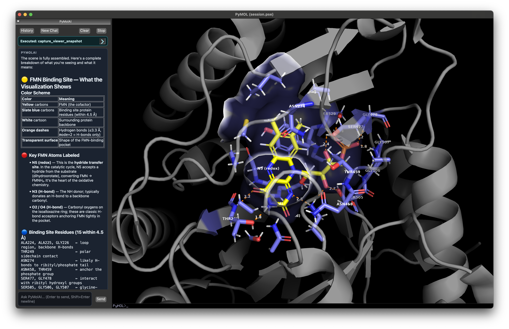
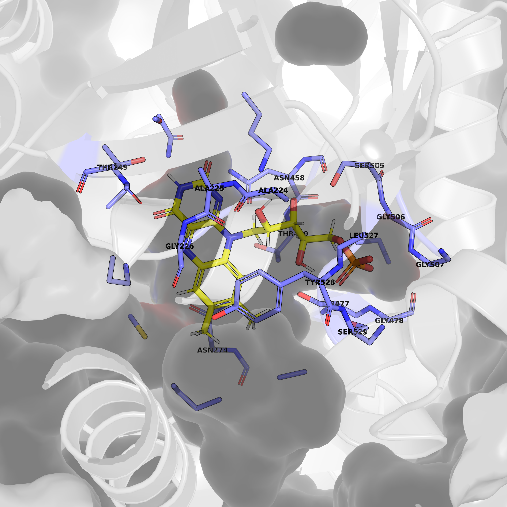

# PyMolAI on Open-Source PyMOL

PyMolAI extends open-source PyMOL with an integrated AI assistant panel for molecular workflows.
It adds provider-backed reasoning, tool execution, and optional OpenBio API gateway access while keeping normal PyMOL usage unchanged.

The upstream open-source foundation remains this repository: [pymol-open-source](https://github.com/schrodinger/pymol-open-source).



## Feature Matrix

| Capability | Status |
|---|---|
| Chat panel in Qt desktop UI | Included |
| OpenRouter-backed model access | Included |
| Internal PyMOL tool: `run_pymol_command` | Included |
| Internal validation tool: `capture_viewer_snapshot` | Included |
| OpenBio API gateway tools | Optional (only when `OPENBIO_API_KEY` is set) |
| CLI mode fallback (`/cli`) | Included |

## Requirements

## Python Compatibility

- Base package supports `Python >= 3.9`.
- Full Claude SDK agent path requires `Python >= 3.10` because `claude-agent-sdk` is only installed on 3.10+.

## Runtime Dependencies (AI path)

From `pyproject.toml`:

- `openai>=1.0.0`
- `keyring>=24`
- `claude-agent-sdk>=0.1.38` (Python 3.10+)

## GUI Requirement

PyMolAI chat UI is designed for Qt desktop usage (`pmg_qt`).

## Network/API Requirements

- OpenRouter access for model turns.
- Optional OpenBio access for OpenBio tools (default base URL: `https://api.openbio.tech`).

## Installation Quickstarts

## macOS (source install with uv)

### Step 0 — Clone the repository

```bash
git clone https://github.com/ravishar313/PyMolAI
cd PyMolAI
```

### Step 1 — Install system dependencies (Homebrew)

The C++ build requires several native libraries. Install them before building:

```bash
brew install netcdf glew glm
```

`libxml2` and `freetype` are typically already present via Homebrew. If the build still fails, install them too:

```bash
brew install libxml2 freetype libpng
```

### Step 2 — Create virtualenv and install

Use `uv` (recommended):

```bash
uv venv .venv
source .venv/bin/activate
PREFIX_PATH=/opt/homebrew:/opt/homebrew/opt/libxml2:/opt/homebrew/opt/netcdf uv pip install --python .venv/bin/python --reinstall .
```

### Step 3 — Install PyQt5

PyMOL's Qt GUI layer must use **PyQt5**. PyQt6 is detected later in the fallback chain but has enum API incompatibilities with this codebase. Install PyQt5 explicitly:

```bash
uv pip install --python .venv/bin/python PyQt5
```

### Step 4 — Verify imports

```bash
.venv/bin/python -c "import keyring, openai; print('ok: keyring/openai')"
.venv/bin/python -c "import claude_agent_sdk; print('ok: claude-agent-sdk')"
.venv/bin/python -c "from PyQt5 import QtWidgets; print('ok: PyQt5')"
```

If `claude_agent_sdk` import fails, verify the interpreter is Python 3.10+.

## Windows (PowerShell, source install with uv)

```powershell
git clone https://github.com/ravishar313/PyMolAI
cd PyMolAI
uv venv .venv --python 3.10
.\.venv\Scripts\Activate.ps1
$env:PREFIX_PATH = "C:\path\to\deps"; uv pip install --python .venv\Scripts\python.exe --reinstall .
uv pip install --python .venv\Scripts\python.exe PyQt5
```

Optional import verification:

```powershell
python -c "import keyring, openai; print('ok: keyring/openai')"
python -c "import claude_agent_sdk; print('ok: claude-agent-sdk')"
python -c "from PyQt5 import QtWidgets; print('ok: PyQt5')"
```

## First-Run Setup

1. Launch PyMOL.
2. Open AI settings from:
- `Display -> PyMolAI Settings -> OpenRouter API Key...`
- `Display -> PyMolAI Settings -> OpenBio API Key...`
3. To create an OpenBio API key, sign up at [openbio.tech](https://openbio.tech/) first.
4. In the OpenRouter dialog:
- Save key (stores in system keychain)
- Test key
- Clear key
5. In the OpenBio dialog (optional):
- Save key
- Test key
- Clear key

Important behavior:

- Without OpenRouter key (`OPENROUTER_API_KEY` or `ANTHROPIC_AUTH_TOKEN`), AI mode is disabled.
- Without OpenBio key (`OPENBIO_API_KEY`), OpenBio tools are not registered, but the rest of app behavior remains unchanged.

Example scene output:



## Configuration Reference

## Core Provider Variables

- `OPENROUTER_API_KEY`
- `ANTHROPIC_AUTH_TOKEN`
- `OPENBIO_API_KEY`
- `OPENBIO_BASE_URL` (optional override, default is `https://api.openbio.tech`)

## Key Source Tracking Variables

- `PYMOL_AI_OPENROUTER_KEY_SOURCE`
- `PYMOL_AI_OPENBIO_KEY_SOURCE`

## Common Runtime Toggles

- `PYMOL_AI_DISABLE`
- `PYMOL_AI_DEFAULT_MODEL`
- `PYMOL_AI_REASONING_DEFAULT`
- `PYMOL_AI_AGENT_MODE`
- `PYMOL_AI_CONVERSATION_MODE`
- `PYMOL_AI_TRACE_STREAM`

## Troubleshooting

## Keychain Unavailable

Symptom:
- Save/Test dialogs report no keychain backend.

Cause:
- `keyring` is installed but no OS keychain backend is available.

Action:
- Configure OS credential storage (macOS Keychain / Windows Credential Manager), then retry.

## API Key Validation Fails

Symptom:
- Dialog returns invalid/revoked or auth errors.

Action:
- Confirm the key is from the correct provider.
- Re-test with current network/proxy.
- For OpenBio, verify endpoint/network path to `api.openbio.tech`.

## Python 3.9 Environment

Symptom:
- AI runtime cannot use Claude SDK features.

Cause:
- `claude-agent-sdk` is not installed for Python 3.9.

Action:
- Use Python 3.10+ for full PyMolAI agent behavior.

## PyMOL Crashes on Launch with AttributeError in Qt Enums

Symptom:
- `AttributeError: type object 'Qt' has no attribute 'ScrollBarAlwaysOff'` (or similar enum errors).

Cause:
- PyQt6 is installed but not PyQt5. PyMOL detects PyQt6 as a fallback, but the GUI code uses PyQt5-style flat enum access (`Qt.ScrollBarAlwaysOff`) which was namespaced in PyQt6 (`Qt.ScrollBarPolicy.ScrollBarAlwaysOff`).

Action:
- Install PyQt5 explicitly. PyMOL's Qt detection tries PyQt5 first, so it will be used instead of PyQt6:
  ```bash
  uv pip install --python .venv/bin/python PyQt5
  ```

## macOS Build Fails: `netcdf.h` not found

Symptom:
- Build error: `fatal error: 'netcdf.h' file not found`

Action:
- Install netcdf via Homebrew and add it to PREFIX_PATH:
  ```bash
  brew install netcdf
  PREFIX_PATH=/opt/homebrew:/opt/homebrew/opt/libxml2:/opt/homebrew/opt/netcdf uv pip install ...
  ```

## macOS Build Fails: `GL/glew.h` not found

Symptom:
- Build error: `fatal error: 'GL/glew.h' file not found`

Action:
- Install GLEW and GLM via Homebrew:
  ```bash
  brew install glew glm
  ```

## OpenBio Unavailable but OpenRouter Works

Symptom:
- Regular AI works, OpenBio tools do not appear or fail.

Action:
- Ensure `OPENBIO_API_KEY` exists (or save in OpenBio dialog).
- Confirm `OPENBIO_BASE_URL` if overridden.
- Check network restrictions/firewall policy.

## Security Notes

- API keys are masked in UI status (for example `****abcd`).
- Key save/clear flows use system keychain via `keyring`.
- Saved keys can be loaded into environment at runtime startup.
- Avoid putting real keys in scripts or checked-in files.

## License and Attribution

- The legal project license remains unchanged in [`LICENSE`](LICENSE).
- PyMolAI additions in this fork are documented under the same repository licensing context.
- AI service/library usage notes are listed in [`docs/THIRD_PARTY_AI.md`](docs/THIRD_PARTY_AI.md).
- Fork maintainer attribution for PyMolAI additions is included in [`LICENSE`](LICENSE), [`AUTHORS`](AUTHORS), and [`DEVELOPERS`](DEVELOPERS), with upstream Schrodinger notices preserved.

## Maintainer Contact

- Website: [proteinlanguagemodel.com](https://proteinlanguagemodel.com/)
- X/Twitter: [@ravishar313](https://x.com/ravishar313)

## Legacy Upstream Notes

For historical upstream notes, see [`README`](README) and [`INSTALL`](INSTALL).
